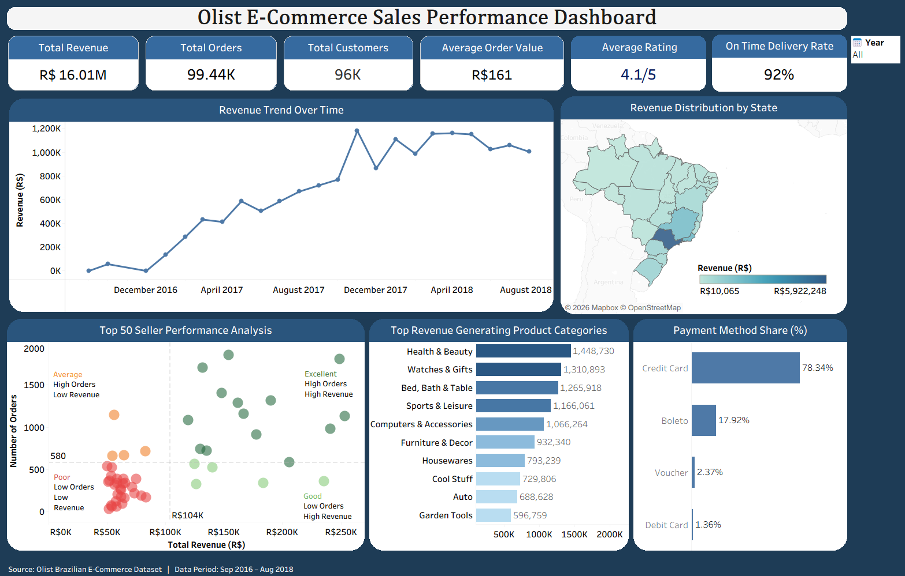

# Olist E-Commerce Sales Analysis

A Business Intelligence project that leverages PostgreSQL and Tableau to analyze the Olist Brazilian E-Commerce dataset, transforming raw transactional data into actionable business insights through SQL analysis and interactive dashboard.

## Project Overview

Olist is a Brazilian e-commerce marketplace that connects small retailers to major sales channels. This project analyzes data across 9 relational tables to evaluate sales performance, customer purchasing patterns, product category trends, seller performance, payment behavior, delivery efficiency and customer satisfaction. The analysis aims to uncover insights that can support business decision making and operational improvement.

## Tools & Technologies

Database — PostgreSQL 

Data visualization — Tableau

## Analysis Highlights

- Business Overview
- Customer Analysis
- Product Analysis
- Seller Analysis
- Delivery Analysis
- Customer Review Analysis
- Key Business Insights

## Business Questions Answered

- What is the total revenue generated?
- How many customers and orders does the business have?
- What is the Average Order Value (AOV)?
- How has revenue changed over time?
- Which payment methods generate the highest revenue?
- Which states contribute the most revenue?
- Which product categories generate the highest revenue?
- Which product categories have the highest freight costs?
- Which sellers contribute the highest revenue?
- How efficient is the delivery process?
- How do customer reviews relate to delivery performance?
- Which business areas require operational improvement?

## Key Insights

- Generated **R$16.01M** in total revenue.
- Processed approximately **99K orders** from **96K unique customers**.
- Achieved an **Average Order Value (AOV)** of **R$161**.
- **São Paulo** generated the highest overall revenue.
- **Credit Card** was the most preferred payment method.
- A small group of sellers contributed a significant share of total revenue.
- Sales were concentrated across a few high-performing product categories.
- Approximately **92%** of orders were delivered on time.
- Delivery delays showed a noticeable impact on customer review ratings.

## Dashboard Preview

## Dataset

Source: Kaggle — Brazilian E-Commerce Public Dataset by Olist

Period: 2016 to 2018

Scale: ~100,000 orders across 9 tables

## Contact

Email: pratikshyadash590@gmail.com

